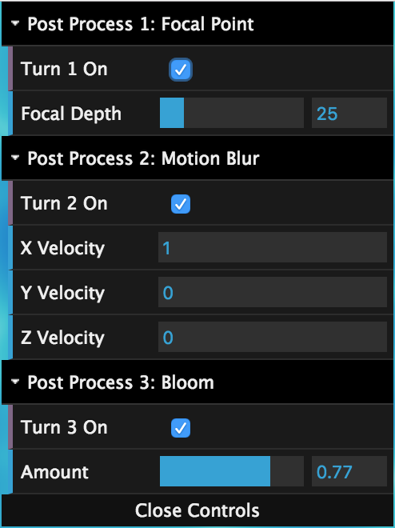

# Project 7: Deferred Renderer

Name: Alexis Ward

PennKey: aleward

Demo Link: [here](https://aleward.github.io/deferred-renderer-aleward/)

**Goal:** Learn an advanced rendering technique using the OpenGL pipeline and apply it to make artistic procedural post-processing effects.

## Post passing data to G-Buffers, basic scene shading, and HDR Tone Mapping

## Post-process effects (75 points)
* __Bloom:__

* __Approximated depth of field:__

* __Motion blur:__

There is a very small blur based on changing camera properties:

... and a large blur for object motion:

## Extra credit (30 points max)
* Dat.GUI

